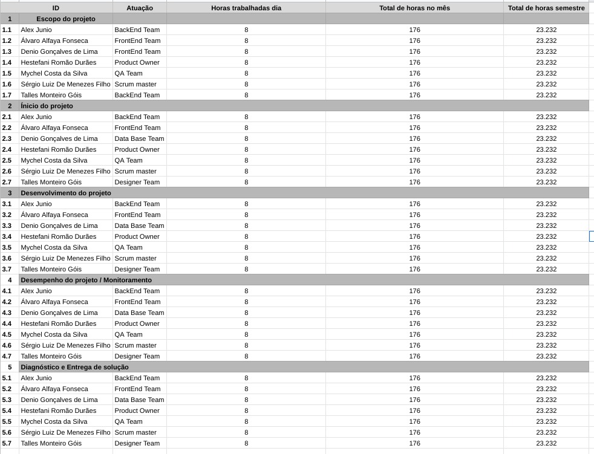
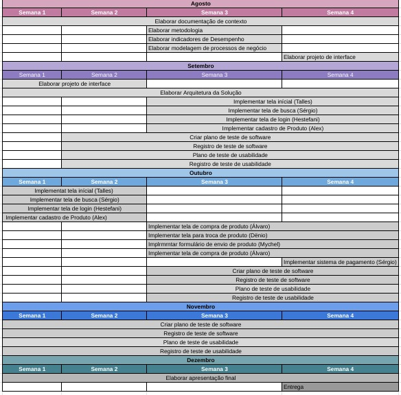
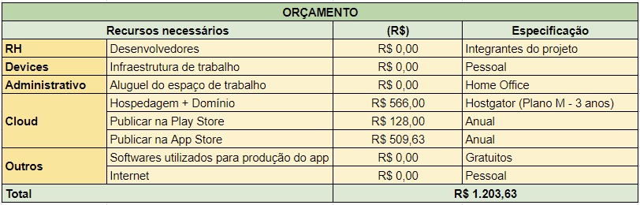

# Especificações do Projeto

A definição exata do problema e dos pontos mais relevantes deste projeto foi realizada através de discussões entre os membros da equipe. Os principais pontos levantados durante o processo foram consolidados na forma de personas e histórias de usuário mostradas a seguir.

## Personas

|Tamara Silva      | Informações:                       |                                        |
|--------------------|------------------------------------|----------------------------------------|
|| **Idade:** 23   **Ocupação:** Estudante de Jornalismo |**Aplicativos:** ● Instagram ● Tiktok |
|**Motivações:** ● Concluir sua faculdade ●  Ter acesso a novos tipos de  tênis. |**Frustrações:** ● Aumento do custo de vida e do custo dos  produtos em geral. |**Hobbies:** ● Viajar ● Música  ● Cozinhar |

|Felipe Souza      | Informações:                       |                                        |
|--------------------|------------------------------------|----------------------------------------|
|| **Idade:** 27   **Ocupação:**  Especialista em marketing, colecionador amador de tênis de marca |**Aplicativos:** ● Tiktok ● Facebook ● LinkedIn |
|**Motivações:** ● Adicionar novos itens à sua  coleção de tênis ● Conhecer pessoas que  compartilhem seu hobby |**Frustrações:** ● Dificuldade para achar modelos de tênis  raros/antigos em bom estado. |**Hobbies:** ● Colecionar tênis ● Assistir séries |

|Luiz Felipe     | Informações:                       |                                        |
|--------------------|------------------------------------|----------------------------------------|
|| **Idade:** 32   **Ocupação:**  Analista financeiro,  apaixonado por esportes |**Aplicativos:** ● Instagram ● Pinterest ● LinkedIn |
|**Motivações:** ● Defender sua tese de  doutorado. ● Encontrar uma comunidade  que adora Jordans.|**Frustrações:** ● Dificuldade em encontrar pessoas que  queiram realizar a troca de Jordans. |**Hobbies:** ● Tocar Violão ● Correr ● Assistir Futebol |

|Douglas Gonçalves     | Informações:                       |                                        |
|--------------------|------------------------------------|----------------------------------------|
|| **Idade:** 33   **Ocupação:**  Advogado,  apaixonado por esportes |**Aplicativos:** ● Instagram ● Facebook ● LinkedIn |
|**Motivações:** ● Trocar seus tênis esportivos   antigos por  outros diferentes ● Conhecer pessoas que  pratiquem esportes e queiram  comprar ou trocar seus tênis  por tênis esportivos usados. |**Frustrações:** ● Dificuldade para armazenar seus tênis  que estão em bom estado  por estar comprando sempre lançamentos   e acumulando. |**Hobbies:** ● Colecionar tênis  esportivos ● Praticar esportes |

## Histórias de Usuários

Com base na análise das personas foram identificadas as seguintes histórias de usuários:

|EU COMO... `PERSONA`| QUERO/PRECISO ... `FUNCIONALIDADE` |PARA ... `MOTIVO/VALOR`                 |
|--------------------|------------------------------------|----------------------------------------|
|Tamara Silva        | Ter acesso a uma plataforma aonde possa obter várias opções de tênis usados de forma acessível. |Poder variar nas minhas escolhas de tênis no dia a dia. |
|Tamara Silva        | Poder trocar tênis dos quais já enjoei por outros tênis de valor similar. | Poder economizar dinheiro na hora de obter novos modelos de tênis. |
|Felipe Souza        | Poder buscar por modelos de tênis específicos e visualizar todas as informações relevantes aos mesmos. | Poder avaliar se os tênis anunciado atendem às suas expectativas antes de realizar a transação. |
|Felipe Souza        | Realizar a troca de seus tênis por meio de uma empresa segura que garanta a integridade do produto e o assegure em caso de fraude. | Poder obter os modelos de tênis que deseja sem o risco de receber produtos falsificados ou em estado de conservação ruim. |
|Luiz Felipe         | Poder comprar ou trocar tênis de uma determinada marca por outros tênis da mesma marca, porém modelos diferentes| Encontrar pessoas com jordans de edições limitadas para realizar a troca ou compra. |
|Douglas Gonçalves   | Poder trocar seus tênis de esportes de alto rendimento antigos em bom estado por outros tênis diferentes| Poder trocar seus tênis de alto rendimento por outros variados, já que os de alto rendimento ele sempre compra lançamentos e não quer acumular espaços com os antigos. |

## Modelagem do Processo de Negócio

### Análise da Situação Atual

Apresente aqui os problemas existentes que viabilizam sua proposta. Apresente o modelo do sistema como ele funciona hoje. Caso sua proposta seja inovadora e não existam processos claramente definidos, apresente como as tarefas que o seu sistema pretende implementar são executadas atualmente, mesmo que não se utilize tecnologia computacional.

### Descrição Geral da Proposta

Apresente aqui uma descrição da sua proposta abordando seus limites e suas ligações com as estratégias e objetivos do negócio. Apresente aqui as oportunidades de melhorias.

### Processo 1 – NOME DO PROCESSO

Apresente aqui o nome e as oportunidades de melhorias para o processo 1. Em seguida, apresente o modelo do processo 1, descrito no padrão BPMN.

### Processo 2 – NOME DO PROCESSO

Apresente aqui o nome e as oportunidades de melhorias para o processo 2. Em seguida, apresente o modelo do processo 2, descrito no padrão BPMN.

## Indicadores de Desempenho

|#|Indicador|Objetivos|Descrição|Calculo|Fonte|Perspectiva|
|--|------|--------|--------|---------|--------|-----------|
|1|download|Acompanhar a taxa de crescimento do aplicativo|Avaliar a taxa de downloads realizados|numero de downloads|Playstore/AppleStore|Crescimento do app|
|2|Avaliaçao na PlayStore/AppleStore|acompanhar o feedback dos usuarios|Medir a media das avaliaçoes dadas pelo usuarios|Numero das estrela dada pelo usuario|Playstore/AppleStore|qualidade do produto| 
|3|Desinstalação|Avaliar o que pode ser mudado para prevenir outras desinstalações do aplicativo|entender oque levou o usuario a desintalar o app|numero de desinstalações feitas|Playstore/AppleStore|qualidade do produto|
|4|taxa de vendas/trocas feitas|acompanhar as vendas/trocas que estao sendo feitas pelos os usuarios|verificar a quantidade de trocas/vendas que estao sendo feitas|numero de trocas/vendas que  foram concluidas|Banco de dados|melhoria continua|
|5|Curadoria|verificar se a curadoria estar prestando o serviços corretamente|avaliar os serviços prestados pela curadoria|Avaliçao dos usuarios|banco de dados|qualidade do produto|

## Requisitos

As tabelas que abaixo apresentam os requisitos funcionais e não funcionais que delimitam o escopo do projeto, bem como uma descrição do processo utilizado para determinar a prioridade de cada requisito apresentado.

### Requisitos Funcionais

|ID    | Descrição do Requisito  | Prioridade |
|------|-----------------------------------------|----|
|RF-001| Disponibilizar um sistema de login e autenticação, onde o usuário poderá criar uma conta com dados válidos e realizar login. | ALTA |
|RF-002| Disponibilizar aos usuários uma plataforma aonde possam cadastrar seus tênis usados para visualização por outros usuários que possam estar interessados, adicionando fotos, descrição e preço desejado. | ALTA |
|RF-003| Disponibilizar aos usuários uma plataforma uma página de produtos aonde poderão visualizar tênis cadastrados por outros usuários.   | ALTA |
|RF-004| Disponibilizar um sistema de mensagens onde os usuários poderão conversar entre si a respeito dos produtos e combinar possíveis trocas.   | MÉDIA |
|RF-005| Disponibilizar uma funcionalidade onde os usuários poderão escolher comprar um produto cadastrado ou fazer “ofertas” de troca do produto por outro produto cadastrado. Sendo que o usuário ao qual a oferta de troca foi feita poderá visualizar todas as ofertas em aberto e optar por aceitar ou recusar as mesmas. | ALTA |
|RF-006| Disponibilizar um formulário de envio das mercadorias, que ocorreira primeiro para a empresa (que realizará a curadoria dos produtos para determinar se estão em bom estado) e depois para os clientes. | ALTA |
|RF-007| Disponibilizar um sistema de pagamento para que os usuários possam pagar os custos relativos ao envio, serviço de curadoria e preço do produto em caso de compra. | ALTA |
|RF-008| Disponibilizar uma tabela de medida em centímetros do pé de acordo com a numeração do tênis, afim de solucionar problemas de devoluções. | MÉDIA |

### Requisitos não Funcionais

|ID     | Descrição do Requisito  |Prioridade |
|-------|-------------------------|----|
|RNF-001| O sistema deve ser responsivo para rodar em um dispositivos móvel | MÉDIA |
|RNF-002| O sistema deverá ser desenvolvido utilizando-se o framework React Native. |  ALTA |
|RNF-003| O sistema deverá garantir a segurança dos dados sensíveis do usuário por meio de criptografia. |  ALTA |
|RNF-004| A aplicação deve ser intuitiva, de fácil utilização e entendimento, descartando a necessidade de treinamentos. |  MÉDIA |
|RNF-005| A aplicação deve possuir uma interface limpa, com visualização voltada apenas para as necessidades do usuário no momento, também como forma de melhorar a performance e o desempenho. | MÉDIA |

A técnica para priorização de requisitos utilizada foi a Escala de Três Níveis. Uma das abordagens mais diretas para o levantamento da prioridade dos requisitos de um software é identificar, quais valores devem ser atribuídos ao atributo "Prioridade", sendo possível reduzirmos essas prioridades a três níveis: Alto, Médio e Baixo.
Assim, a técnica da Escala de Três Níveis busca delimitar o universo de possíveis valores desse atributo para tais possibilidades, de modo que a prioridade seja uniformizada e melhor entendida por todos do time.
Visto que esta é uma técnica bastante simples, é comum que alguns times estabeleçam os níveis de prioridade de acordo com dois aspectos principais: importância e urgência. Assim, forma-se um quadrante, capaz de criar prioridades que combinem esses aspectos.

## Restrições

O projeto está restrito pelos itens apresentados na tabela a seguir.

|ID| Restrição                                             |
|--|-------------------------------------------------------|
|01| O projeto deverá ser entregue até o final do semestre |
|02| Não pode ser desenvolvido um módulo de backend        |

## Diagrama de Casos de Uso

O diagrama ilustrado abaixo demonstra as principais ligações entre casos de uso e atores em relação aos Requisitos Funcionais do projeto.

<b>Figura 1 </b> – Diagrama de casos de uso.

# Matriz de Rastreabilidade

A matriz de rastreabilidade mostrada abaixo ilustra o relacionamento entre requisitos e outros artefatos ou objetos deste projeto, permitindo a rastreabilidade entre os requisitos e os objetivos de negócio.

# Gerenciamento de Projeto

De acordo com o PMBoK v6 as dez áreas que constituem os pilares para gerenciar projetos, e que caracterizam a multidisciplinaridade envolvida, são: Integração, Escopo, Cronograma (Tempo), Custos, Qualidade, Recursos, Comunicações, Riscos, Aquisições, Partes Interessadas. Para desenvolver projetos um profissional deve se preocupar em gerenciar todas essas dez áreas. Elas se complementam e se relacionam, de tal forma que não se deve apenas examinar uma área de forma estanque. É preciso considerar, por exemplo, que as áreas de Escopo, Cronograma e Custos estão muito relacionadas. Assim, se eu amplio o escopo de um projeto eu posso afetar seu cronograma e seus custos.

## Gerenciamento de Tempo

O gráfico de Gantt ou diagrama de Gantt também é uma ferramenta visual utilizada para controlar e gerenciar o cronograma de atividades de um projeto. Com ele, é possível listar tudo que precisa ser feito para colocar o projeto em prática, dividir em atividades e estimar o tempo necessário para executá-las.

## Gerenciamento de Equipe

O gerenciamento adequado de tarefas contribuirá para que o projeto alcance altos níveis de produtividade. Por isso, é fundamental que ocorra a gestão de tarefas e de pessoas, de modo que os times envolvidos no projeto possam ser facilmente gerenciados.

 

## Gestão de Orçamento

O processo de determinar o orçamento do projeto é uma tarefa que depende, além dos produtos (saídas) dos processos anteriores do gerenciamento de custos, também de produtos oferecidos por outros processos de gerenciamento, como o escopo e o tempo.

