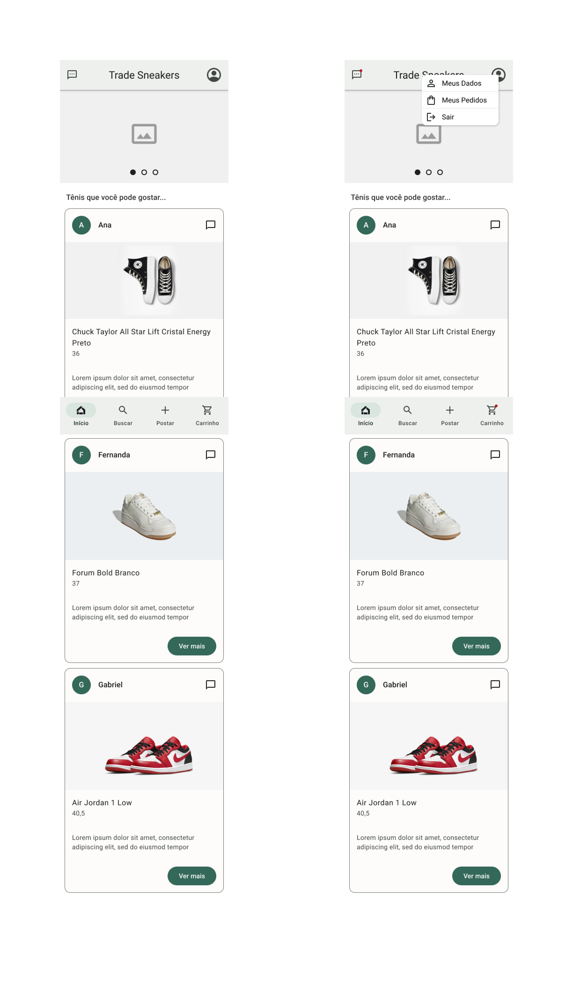

# Projeto de Interface

 Com a usabilidade sendo uma das questões focadas para a montagem da interface do aplicativo. Estabelecemos uma identidade visual padronizada com telas projetadas seguindo o Material Design 3 da Google.

## Diagrama de Fluxo

O diagrama abaixo apresenta o fluxo de interação do usuário com o aplicativo. Este diagrama se foca no fluxo mais provável que o usário seguirá, já que algumas das telas deixará o usuário realizar outros fluxos que deixariam o diagrama mais complexo e confuso se fossem detalhados. As telas deste fluxo são descritas melhor na [seção de wireframes logo abaixo](#wireframes).

## Wireframes

Os protótipos foram desenvolvidos no Figma e seguem o Material Design 3, a estrutura e seus relacionamentos entre suas páginas podem ser [visualizas no Figma](https://www.figma.com/proto/DsketTFONtcTTb3mKTRZzn/Wireframes) e a estrutura dos elementos fundamentais em cada tela é explicada abaixo.

 - [Wireframes no Figma](https://www.figma.com/file/DsketTFONtcTTb3mKTRZzn/Wireframes)
 - [Apresentação interativa dos Wireframes](https://www.figma.com/proto/DsketTFONtcTTb3mKTRZzn/Wireframes)

### Tela: Início (Homepage)

A primeira tela que o usuário verá ao iniciar o aplicativo apresenta um *carousel* de *slides* com anúcios da empresa e logo abaixo, uma lista com sugestões de tênis que o usuário pode gostar e visualizar mais informações ou conversar com o usuário que postou o tênis.

No cabeçalho existe um botão para ver a [lista de conversas](#tela-lista-de-conversas) (que só pode ser acessada após o *login*) e um botão para ir à [tela de fazer *login*](#tela-entrar-sign-in), quando o usuário estiver conectado em sua conta, o botão que levaria ao *login* apresenta um *dropdown* com opções para levar o usuário à tela "[Meus Dados](#tela-meus-dados)" ou "[Meus Pedidos](#tela-meus-pedidos)", além de se desconectar.

E na parte de baixo, um menu de navegação fixo com opções para levar o usuário à tela "[Buscar](#tela-buscar)", "[Postar](#tela-postarcadastrar-produto)" (acessível apenas depois do *login*) ou "[Carrinho](#tela-carrinho)" (acessível apenas depois do *login*).

### Tela: Buscar

Na tela de busca, o usuário vai encontrar um campo de busca e um filtro para selecionar a medida desejada para o tênis. Após realizar a busca, receberá uma lista com os resultados e poderá clicar em um para ver mais informações.

 O cabeçalho e o menu de navegação presente na tela inicial também aparece na tela de busca.

    

### Tela: Postar/Cadastrar produto

Esta tela é acessível apenas para usuários conectados. O usuário encontrará na tela campos para cadastrar informações do seu tênis, escrever uma descrição sobre o estado de conservação e um campo para adicionar a URL de imagens do tênis, podendo adicionar outras imagens clicando no botão "Adicionar Mais Imagens". 

O cabeçalho e o menu de navegação presente na tela inicial também aparece na tela de busca.

    

### Tela: Carrinho

Esta tela é acessível apenas para usuários conectados. O usuário poderá visualizar todos os tênis que ele adicionou ao carrinho quando clicou no botão de compra ou teve a proposta de troca aprovada, é possível selecionar os que tênis que deseja finalizar a compra, tendo também a opção de selecionar todos de uma vez ou remover um tênis ao deslizar o dedo para a esquerda sobre um tênis para ver o botão de remover.

O cabeçalho e o menu de navegação presente na tela inicial também aparece na tela de busca.

    

### Tela: Produto

O usuário pode acessar essa tela sem se conectar a uma conta mas seu acesso será limitado a algumas funções. Nessa tela o usuário poderá ver as fotos e descrição do tênis, além de detalhes, como tamanho, marca e modelo. Quando conectado em uma conta, o usuário também poderá clicar no botão para conversar com o dono do tênis, adicionar ao carrinho para pagar ou enviar uma proposta de troca por outro tênis que ele tenha cadastrado no aplicativo.

O menu de navegação presente na tela inicial desaparece nesta tela. O cabeçalho passa a apresentar um botão para retornar à página anterior e o título do produto.

    

### Tela: Entrar (Sign in)

Nesta tela o usuário poderá inserir o usuário e a senha para se conectar ou clicar no botão "[Registrar-se](#tela-registrar-se-sign-up)" para se cadastrar. Caso tenha esquecido a senha, também poderá recuperá-la ao clicar em "Esqueceu sua senha?".

O menu de navegação presente na tela inicial desaparece nesta tela. O cabeçalho passa a apresentar um botão para retornar à página anterior e o título da tela "Entrar".

    

### Tela: Registrar-se (Sign up)

Nesta tela o usuário poderá criar sua conta de usuário ao inserir os dados necessários nos campos corretos e confirmar. Ao confirmar e o processo ser concluido com sucesso, o usuário receberá uma notificação com as opções de [ir fazer o *login*](#tela-entrar-sign-in) ou deixar para mais tarde.

O menu de navegação presente na tela inicial desaparece nesta tela. O cabeçalho passa a apresentar um botão para retornar à página anterior e o título da tela "Registrar".

### Tela: Meus Dados

Esta tela é acessível apenas para usuários conectados. Nela o usuário poderá editar informações que cadastrou anteriormente e também adicionar informações do seu endereço.

O menu de navegação presente na tela inicial desaparece nesta tela. O cabeçalho passa a apresentar um botão para retornar à página anterior e o título da tela "Meus Dados".

    

### Tela: Meus Pedidos

### Tela: Lista de conversas

### Tela: Chat

Esta tela é acessível apenas para usuários conectados. Nela o usuário poderá conversar com outro usuário. Quando for clicado em "Trocar" na [tela de informações do produto](#tela-produto) o usuário será direcionado para o chat onde poderá escolher um tênis seu cadastrado para oferecer como troca, ao clicar no botão de enviar mensagem, o destinatário receberá uma notificação dentro do chat da proposta de troca e poderá confirmar clicando num botão "Aceitar". O usuário poderá cancelar a proposta de troca, enquanto não for confirmada, clicando no botão "Cancelar".

O menu de navegação presente na tela inicial desaparece nesta tela. O cabeçalho passa a apresentar um botão para retornar à página anterior, o título da tela apresenta o nome de usuário do destinatário.

