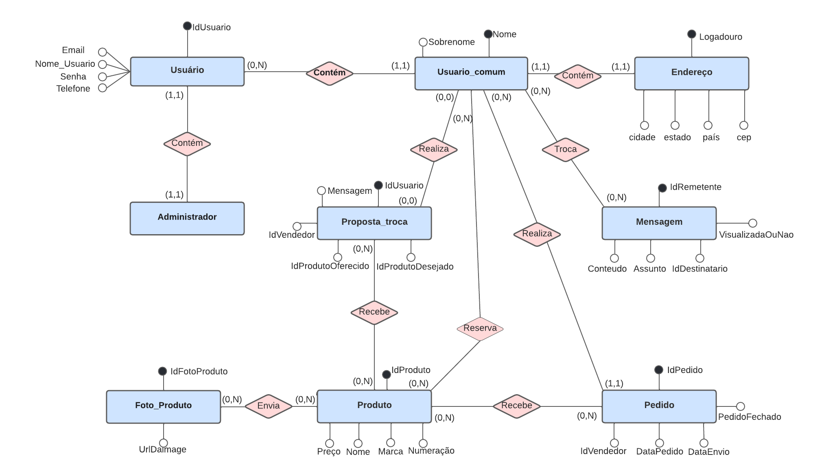
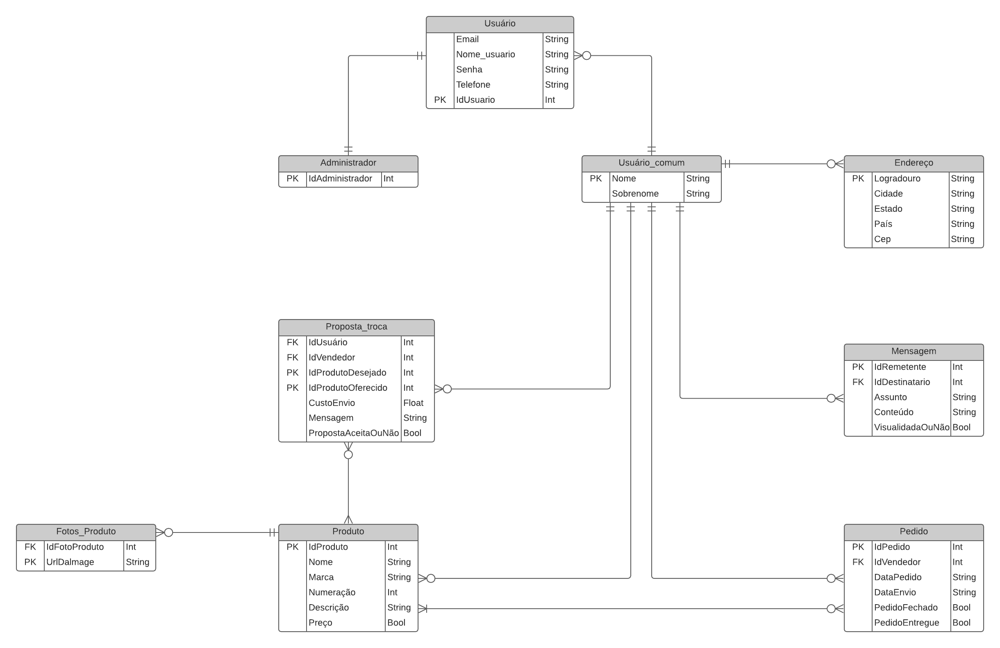

# Arquitetura da Solução

Pré-requisitos: <a href="3-Projeto de Interface.md"> Projeto de Interface</a>

Definição de como o software é estruturado em termos dos componentes que fazem parte da solução e do ambiente de hospedagem da aplicação.

## Diagrama de Classes

<b>Figura X</b> - Diagrama de classes do projeto

 

## Modelo ER

Diagrama que descreve o conjunto de entidades do sistema, seus atributos e relacionamentos.

## Esquema Relacional

O Esquema Relacional corresponde à representação dos dados em tabelas juntamente com as restrições de integridade e chave primária.
 

## Modelo Físico

Entregar um arquivo banco.sql contendo os scripts de criação das tabelas do banco de dados. Este arquivo deverá ser incluído dentro da pasta src\bd.

## Tecnologias Utilizadas

Descreva aqui qual(is) tecnologias você vai usar para resolver o seu problema, ou seja, implementar a sua solução. Liste todas as tecnologias envolvidas, linguagens a serem utilizadas, serviços web, frameworks, bibliotecas, IDEs de desenvolvimento, e ferramentas.

Apresente também uma figura explicando como as tecnologias estão relacionadas ou como uma interação do usuário com o sistema vai ser conduzida, por onde ela passa até retornar uma resposta ao usuário.

|**LINGUAGEM**|
|:---------:|
|JAVASCRIPT|
|**FRAMEWORK**|       
|REACT|
|REACT NATIVE|
|**BIBLIOTECAS**|
|REACT NATIVE PAPER|
|**IDES**|
|EXPO DEV SNACKS|
|**FERRAMENTAS**|
|MICROSOFT TEAMS|
|GITHUB|
|TRELLO|

## Hospedagem

Explique como a hospedagem e o lançamento da plataforma foi feita.

> **Links Úteis**:
>
> - [Website com GitHub Pages](https://pages.github.com/)
> - [Programação colaborativa com Repl.it](https://repl.it/)
> - [Getting Started with Heroku](https://devcenter.heroku.com/start)
> - [Publicando Seu Site No Heroku](http://pythonclub.com.br/publicando-seu-hello-world-no-heroku.html)

## Qualidade de Software

O conceito de Qualidade de Software refere-se a um conjunto de fatores que precisam ser atendidos, isso representa que a aplicação precisa estar em conformidade com as especificações de requisitos que foram combinadas junto ao cliente e também deve seguir os padrões de qualidade da empresa.

Cada ferramenta terá funções específicas, necessidades e também objetivos diversos, por isso a Qualidade de Software é medida pelo atendimento às necessidades do usuário e através da realização de testes essa ferramenta torna-se muito mais assertiva, sendo os resultados condizentes ao que o cliente espera da aplicação.

Existem normas internacionais a serem seguidas pelo setor de software.A International Organization Standardization (ISO) e a International Electrotechnical Commission (IEC) são órgãos reconhecidos pela comunidade e regulam estas normas e padrões, contam com a finalidade de estabelecer um alinhamento aos membros de uma equipe para que superem suas barreiras de comunicação.

Podemos citar como referência a ISO/IEC 25010 para Qualidade de Software. O modelo de qualidade determina quais características de qualidade serão levadas em consideração ao avaliar as propriedades de um produto de software e a ISO/IEC 25010 compreende as oito características de qualidade citadas no quadro abaixo:

| Característica de qualidade | Subcaracteristicas  |     Justificativa     | 
|-----------------------------|--------------------------------------------|-----------------------|
| Adequação Funcional | Completude funcional; Correção funcional; Adequação funcional | Essa característica representa o grau em que um produto ou sistema fornece funções que atendem às necessidades declaradas e implícitas quando usado sob condições especificadas. | 
| Eficiência de Desempenho | Comportamento do tempo; Utilização de Recursos; Capacidade | Essa característica representa o desempenho em relação à quantidade de recursos utilizados nas condições estabelecidas. | 
| Compatibilidade | Coexistência; Interoperabilidade | Grau em que um produto, sistema ou componente pode trocar informações com outros produtos, sistemas ou componentes e/ou desempenhar suas funções necessárias enquanto compartilha o mesmo ambiente de hardware ou software  |
| Usabilidade | Reconhecimento de adequação; Aprendizagem; Operabilidade; Proteção contra erros do usuário; Estética da interface de usuário; Acessibilidade | Grau em que um produto ou sistema pode ser usado por usuários específicos para atingir objetivos específicos com eficácia, eficiência e satisfação em um contexto de uso específico. | 
| Confiabilidade | Maturidade; Disponibilidade; Tolerância a falhas; Recuperação | Grau em que um sistema, produto ou componente executa funções especificadas sob condições especificadas por um período de tempo especificado. |
| Segurança | Confidencialidade; Integridade; Não repúdio; Autenticidade | Grau em que um produto ou sistema protege informações e dados para que pessoas ou outros produtos ou sistemas tenham o grau de acesso a dados adequado aos seus tipos e níveis de autorização. |
| Manutenibilidade| Modularidade; Reutilização; Analisabilidade; Modificabilidade; Testabilidade | Essa característica representa o grau de eficácia e eficiência com que um produto ou sistema pode ser modificado para melhorá-lo, corrigi-lo ou adaptá-lo às mudanças no ambiente e nos requisitos. |
| Portabilidade | Adaptabilidade; Instabilidade; Substituibilidade | Grau de eficácia e eficiência com que um sistema, produto ou componente pode ser transferido de um hardware, software ou outro ambiente operacional ou de uso para outro.  |

| Subcaracterística  |                      Métricas  de Qualidade de Software               |  Peso  |
|--------------------|-----------------------------------------------------------------------|--------|
| Adequação | É adequado as necessidades do usuário? | Alto
| Acurácia | Faz o que foi proposto de forma correta?  | Alto |
| Interoperabilidade | É capaz de interagir com os sistemas especificados? | Alto |
| Conformidade | Está de acordo com as normas, leis, relacionadas a funcionalidade?| Alto |
| Conformidade | Está de acordo com as normas, leis, relacionadas a confiabilidade? | Alto |
| Conformidade | Está de acordo com as normas, leis, relacionadas a usabilidade? | Alto |
| Conformidade | Está de acordo com as normas, leis, relacionadas à eficiência? | Alto |
| Conformidade | Está de acordo com as normas, leis, relacionadas à manutenibilidade? | Alto |
| Conformidade | Está de acordo com as normas, leis, relacionadas à Portabilidade? | Alto |
| Segurança de acesso | Evita acesso não autorizado a programas e dados? | Alto |
| Maturidade | Com que Frequência apresenta falhas? | Alto |
| Tolerância a falhas | Ocorrendo falhas, como ele reage? | Alto |
| Recuperabilidade | É capaz de recuperar dados após uma falha? | Alto |
| Adaptabilidade | O software é capaz de executar todas as suas funções em diferentes dispositivos?  | Alto |
| Inteligibilidade | É fácil entender os conceitos utilizados? | Alto |
| Apreensibilidade | É fácil aprender a usar? | Alto |
| Operacionalidade | É fácil operar e controlar? | Alto |
| Atratividade | É atrativo ao usuário? | Alto |
| Comportamento em relação ao tempo | Qual o tempo de resposta e processamento? | Alto |
| Comportamento em relação aos recursos | Qual recurso usa? Durante quanto tempo? | Alto |
| Analisabilidade | É fácil encontrar uma falha? Quando ocorre? | Alto |
| Modificabilidade | É fácil modificar e remover defeitos? | Alto |
| Estabilidade | Existe riscos de efeitos inesperados quando se faz alterações? | Alto |
| Testabilidade | É fácil testa o software modificado? | Alto |
| Adaptabilidade | É fácil adaptar a ambientes diferentes? | Alto |
| Capacidade para instalar | É fácil para fazer instalação? | Alto |
| Capacidade para substituir| É fácil usar para substituir outro?| Alto |
| Coexistência | Pode coexistir com outros produtos independentes compartilhando recursos? | Alto |

