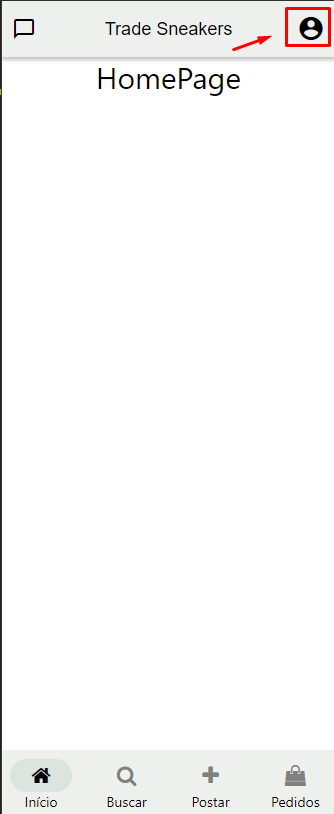
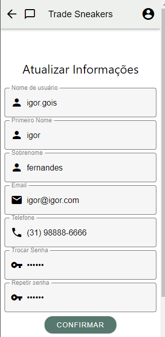
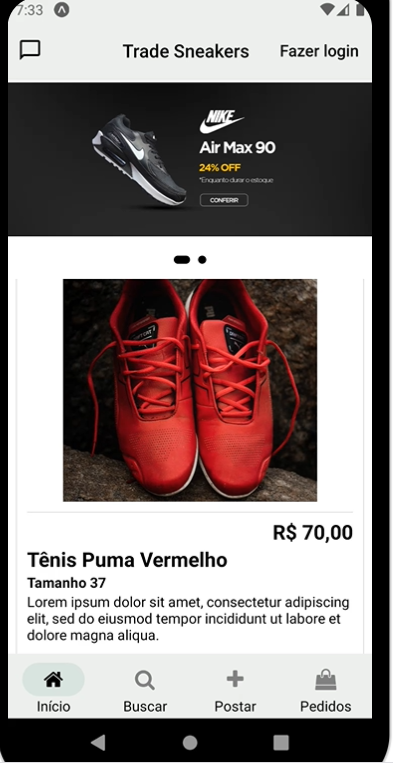
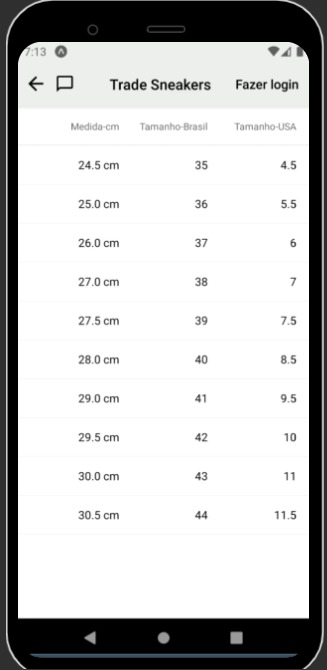

# Programação de Funcionalidades

Nessa seção são apresentadas as telas correspondentes as funcionalidades implementadas. As instruções de acesso da aplicação são apresentadas a seguir:

Como o backend do projeto ainda não se encontra hospedado, o usuário que deseja utilizar a aplicação na versão atual deverá rodar o JSON Server em seu próprio computador através dos seguintes passos:
- Fazer download do arquivo db.json presente na pasta https://github.com/ICEI-PUC-Minas-PMV-ADS/pmv-ads-2022-2-e3-proj-mov-t1-time2_tradesneakers/tree/main/src/backend.
- Colocar o arquivo em um diretório e abrir este diretório no VS Code.
- Instalar as bibliotecas JSON Server e JSON Server auth utilizando os comandos "npm install -g json-server" e 
"npm install -g json-server-auth" no terminal do VS Code.
- Instalar o localtunnel utilizando o comando "npm install -g localtunnel".
- Rodar o JSON Server localmente utilizando o comando "json-server-auth db.json" no terminal do VS Code.
- Utilizar o localtunnel para expor a porta 3000 em que o JSON Server está rodando para a internet utilizando o comando "lt --port 3000" no prompt de comando do seu sistema operacional.
- Acessar a URL fornecida pelo localtunnel em um navegador e clicar em "Click to continue" para habilitar a URL.

Após a realização destas etapas para rodar o backend, o usuário deverá acessar o link da aplicação no Snack em https://snack.expo.dev/@sergiomenezes/tradesneakers e seguir os seguintes passos:
- Acessar o arquivo urls.js presente na pasta src/services nos diretórios do Snack (presentes no canto esquerdo da página do Snack acessada através do link acima).
- Substituir a URL presente como valor da variável "BASE_URL" pela nova URL fornecida pelo localtunnel na etapa anterior (as URLs fornecidas são temporárias e deixam de ser válidas após finalizar o processo no prompt de comando, de modo que uma nova URL precisa ser fornecida a cada vez que a aplicação for ser executada).
- Caso deseje rodar a aplicação em um dispositivo físico, baixar o aplicativo "Expo Go" na App Store/Apple Store e escanear o QR code fornecido pelo snack ao clicar na aba de "My device" presente na página do Snack.
- Caso deseje rodar a aplicação em um emulador de Android ou IoS, clicar na taba "Android" ou "IoS" na página do Snack.
Observação: Algumas funcionalidades como o sistema de alertas não funciona apropriadamente ao rodar a aplicação no modo "Web" do Snack. Por isto, é recomendado rodar a aplicação nos emuladores de Android, IoS ou em um dispositivo físico através do Expo Go.

# Funcionalidades progamadas por Sérgio Luiz de Menezes Filho

Nesta seção se encontra a documentação das funcionalidades progamadas pelo membro Sérgio Luiz de Menezes Filho, bem como o vídeo de apresentação explicando o processo de implementação das mesmas.

## Vídeo de apresentação explicando as funcionalidades:
Segue abaixo o link do vídeo hospedado no Youtube contendo a apresentação relacionada à progamação de funcionalidades até o momento presente:

https://youtu.be/7tLjU90fjfw

## Cadastro de conta de usuário (RF-01)
A funcionalidade de cadastro de conta de usuário pode ser acessada a partir da tela de login clicando-se no botão "Registrar-se". O usuário deverá informar seu nome de usuário, e-mail, telefone e a senha que deseja usar (além de repetir a senha). Caso todas as informações sejam válidas e o e-mail já não esteja em uso por outro usuário, o usuário terá sua conta cadastrada receberá uma mensagem de "Cadastro realizado com sucesso" ao clicar no botão "Confirmar".

**Tela - Tela de cadastro de conta de usuário**<br>


**Alerta - Mensagem de sucesso**<br>


Estrutura de dados:
Os dados prenchidos no formulário de cadastro são enviados para o backend em formato JSON na seguinte estrutura:

    {
      "email": "Usuario@email.com",
      "password": "Senha",
      "name": "Usuario",
      "phone": "99999999",
    }

A senha é então encriptada utilizando-se o bcrypjs e os dados são armazenados em formato JSON no backend simulado do JSON server na seguinte estrutura de dados.
```
"users": [
    {
      "email": "Usuario@email.com",
      "password": "$2a$10$adRRvEnLyMsJSPuAWA2bwenACnDlQCqKfVbCzuUrxjVoEbTtY8tTa",
      "name": "Usuario",
      "phone": "99999999",
      "id": 15
    },
]
```
### Requisitos atendidos
- RF-01

### Artefatos da funcionalidade
Páginas:
- RegisterPage.js

Componentes:
- Header.js

Serviços:
- auth.services.js

### Instruções de acesso
- Visualizar a tela inicial do aplicativo;
- Clicar em "Fazer login" no canto direito do cabeçalho;
- Visualizar a tela de login;
- Clicar no botão "Registrar-se";
- Visualizar a tela de cadastro de conta de usuário;
- Preencher as informações solicitadas;
- Clicar no botão "Confirmar";
- Caso as informações sejam válidas e o e-mail já não tenha sido cadastrado anteriormente, visualizar a mensagem de "Usuário cadastrado com sucesso!".

## Login de usuário (RF-01)
A tela de login pode ser acessada clicando na opção "Fazer login" presente no canto direito do cabeçalho, que estará presente caso nenhum usuário esteja logado no sistema. A partir da tela de login, o usuário que já possuir uma conta cadastrada poderá realizar login ao informar seu email e senha cadastrados, sendo redirecionado para a homepage caso o login seja bem sucedido. Após a realização do login, a opção de "Fazer login" no cabeçalho é substituida por um icone de conta de usuário.

**Tela - Tela de login**<br>


**Cabeçalho após login de usuário**<br>


Estrutura de dados:
Os dados prenchidos no formulário de login são enviados em formato JSON para o backend na seguinte estrutura:

    {
      "email": "Usuario@email.com",
      "password": "Senha",
    }

Caso as informações de login estejam corretas, o backend responde a requisição retornando um Token JWT na seguinte estrutura:
```
{
  "accessToken": "xxx.xxx.xxx"
}
```

### Requisitos atendidos
- RF-01

### Artefatos da funcionalidade
Páginas:
- LoginPage.js

Componentes:
- Header.js

Serviços:
- auth.services.js

### Instruções de acesso
- Visualizar a tela inicial do aplicativo;
- Clicar em "Fazer login" no canto direito do cabeçalho;
- Visualizar a tela de login;
- Preencher as informações solicitadas;
- Clicar no botão "Entrar";
- Caso as informações sejam válidas, o login será realizado e o usuário será redirecionado para a homepage, podendo observar que a opção de "Fazer login" do cabeçalho foi substituida por um ícone de conta de usuário.

## Busca de produtos (RF-03)
A tela de busca de produtos poderá ser acessada ao clicar no icone de "Buscar" representado por uma lupa presente no menu de navegação inferior. Dentro desta tela o usuário é capaz de informar um texto na caixa de busca para realizar uma pesquisa e obter assim a lista de tênis filtados de acordo com as palavras utilizadas na busca. O usuário poderá também nesta tela selecionar um filtro de tamanho/numeração do tênis, que realizará a filtragem dos resultados de modo a mostrar somente tênis que possuam a numeração desejada.

**Tela - Tela de busca**<br>


**Tela - Tela de busca após realização de busca**<br>


**Tela - Tela de busca após filtrar resultados por numeração do tênis**<br>

<br>


Estrutura de dados:
As informações sobre os produtos a serem mostrados na tela são recuperadas em formato JSON da API fake criada pelo JSON server na seguinte estrutura:

Obs: Como não possuímos um serviço de armazenamento separado para hospedar as imagens em URLs próprias e o React Native é incapaz de utilizar sources dinâmicos para imagens, as imagens dos produtos estão armazenadas em Base64, com a string completa das imagens tendo sido parcialmente omitidas no exemplo abaixo por serem muito grandes. 
```
    produtos: [
    {
      "id": 1,
      "nome": "Tênis Air Jordan Cinza",
      "tamanho": 40,
      "imagem": "data:image/png;base64,iVBORw0KGgoAAAANSUhEUgAAAsEAAAJSCAIAAACtIY/OAAAAAXNSR0IArs4c6QA...",
      "descricao": "Lorem ipsum dolor sit amet, consectetur adipiscing elit, sed do eiusmod tempor incididunt ut labore et dolore magna aliqua.",
      "preco": 85.5,
    },
    {
      "id": 2,
      "nome": "Tênis Air Jordan Branco e Preto",
      "tamanho": 38,
      "imagem": "data:image/png;base64,iVBORw0KGgoAAAANSUhEUgAAAsEAAAJSCAYAAAAiQxiZAAAAAXNSR0IArs4c6QAA...",
      "descricao": "Lorem ipsum dolor sit amet, consectetur adipiscing elit, sed do eiusmod tempor incididunt ut labore et dolore magna aliqua.",
      "preco": 90,
    },
    {
      "id": 3,
      "nome": "Tênis Vans Amarelo",
      "tamanho": 36,
      "imagem": "data:image/png;base64,iVBORw0KGgoAAAANSUhEUgAAAsEAAAJSCAIAAACtIY/OAAAAAXNSR0IArs4c6QA...",
      "descricao": "Lorem ipsum dolor sit amet, consectetur adipiscing elit, sed do eiusmod tempor incididunt ut labore et dolore magna aliqua.",
      "preco": 100,
    },
    {
      "id": 4,
      "nome": "Tênis All Star Branco",
      "tamanho": 42,
      "imagem": "data:image/png;base64,iVBORw0KGgoAAAANSUhEUgAAAsEAAAJSCAYAAAAiQxiZAAAAAXNSR0IArs4c6QA...",
      "descricao": "Lorem ipsum dolor sit amet, consectetur adipiscing elit, sed do eiusmod tempor incididunt ut labore et dolore magna aliqua.",
      "preco": 75,
    },
    {
      "id": 5,
      "nome": "Tênis Adidas Preto",
      "tamanho": 39,
      "imagem": "data:image/png;base64,iVBORw0KGgoAAAANSUhEUgAAAsEAAAJSCAYAAAAiQxiZAAAAAXNSR0IArs4c6QA...",
      "descricao": "Lorem ipsum dolor sit amet, consectetur adipiscing elit, sed do eiusmod tempor incididunt ut labore et dolore magna aliqua.",
      "preco": 60,
    },
    {
      "id": 6,
      "nome": "Tênis Puma Vermelho",
      "tamanho": 37,
      "imagem": "data:image/png;base64,iVBORw0KGgoAAAANSUhEUgAAAlQAAAJSCAYAAAAFwVs0AAAAAXNSR0IArs4c6QA...",
      "descricao": "Lorem ipsum dolor sit amet, consectetur adipiscing elit, sed do eiusmod tempor incididunt ut labore et dolore magna aliqua.",
      "preco": 70,
    },
  ]
```
### Requisitos atendidos
- RF-03

### Artefatos da funcionalidade
Páginas:
- SearchPage.js

Componentes:
- SearchBar.js
- Header.js
- BottomNavigation.js

Serviços:
- auth.services.js

### Instruções de acesso
- Visualizar a tela inicial do aplicativo;
- Clicar em "Buscar" no menu de navegação inferior;
- Visualizar a tela de busca de produtos;
- Inserir o texto na caixa de busca presente no topo da tela para realizar a busca;
- Visualizar resultados da busca;
- Caso deseje filtrar os resultados da busca pela numeração do tênis, selecionar um tamanho na caixa de seleção presente ao lado de "Filtrar por tamanho";
- Visualizar resultados da busca filtrados pela numeração dos tênis.


## Tela de visualizar conversas (RF-04)
A tela de visualizar conversas poderá ser acessada ao clicar no icone de "Conversas" representado por um balão de conversa presente no canto esquerdo do cabeçalho. Dentro desta tela o usuário poderá visualizar todas as conversas que iniciou com outros usuários da plataforma, podendo visualizar a mensagem mais recente de cada uma delas, bem como a data da mesma, poderá também filtra-las pelo nome do usuário com o qual conversou ao inserir seu nome na caixa de busca presente abaixo do cabeçalho. Dentro dessa tela, o usuário terá a opção de selecionar um novo usuário para iniciar uma nova conversa (clicando no botão "nova conversa" presente na parte inferior da tela e clicando no nome do usuário desejado) ou clicar em uma conversa específica para abri-la na tela de troca de mensagens, aonde poderá visualizar todas as mensagens já trocadas entre ele e o usuário em questão, bem como enviar novas mensagens para a conversa.

**Tela - Tela de visualizar conversas**<br>


**Tela - Tela de visualizar conversas (após filtrar conversas)**<br>


Estrutura de dados:
Como o JSON server é um backend simulado que não permite operações mais complexas a nível de backend, a organização das conversas é feita no frontend a partir dos dados recuperados da tabela "messages" e da tabela "users", de modo que uma lista de conversas é montada baseado na existência ou não de mensagens trocadas com outros usuários, adicionando-se informações como nome e id do usuário em questão, bem como o conteúdo e data da mensagem mais recente trocada entre este e o usuário da aplicação. Os dados das tabelas "messages" e "users" são recuperados nas seguintes estruturas:

**messages**
```
"messages": [
    {
      "id": 1,
      "message": "Teste",
      "authorId": 1,
      "destinataryId": 11,
      "dateSent": "Oct 18 2022 12:31:20",
      "dateSentInTicks": 1666107080965,
      "messageHasBeenSeen": true
    },
    {
      "id": 2,
      "message": "Teste",
      "authorId": 1,
      "destinataryId": 14,
      "dateSent": "Oct 18 2022 12:32:35",
      "dateSentInTicks": 1666107155885,
      "messageHasBeenSeen": true
    },
    {
      "id": 3,
      "message": "A",
      "authorId": 1,
      "destinataryId": 11,
      "dateSent": "Oct 18 2022 12:33:21",
      "dateSentInTicks": 1666107201188,
      "messageHasBeenSeen": true
    },
    {
      "id": 4,
      "message": "teste",
      "authorId": 1,
      "destinataryId": 11,
      "dateSent": "Oct 18 2022 12:43:16",
      "dateSentInTicks": 1666107796571,
      "messageHasBeenSeen": true
    },
  ]
```
**users**
```
"users": [
    {
      "email": "Usuario@email.com",
      "password": "$2a$10$adRRvEnLyMsJSPuAWA2bwenACnDlQCqKfVbCzuUrxjVoEbTtY8tTa",
      "name": "Usuario",
      "phone": "99999999",
      "id": 15
    },
]
```

### Requisitos atendidos
- RF-04

### Artefatos da funcionalidade
Páginas:
- ChatPage.js

Componentes:
- Header.js

Serviços:
- auth.services.js
- messages.services.js

### Instruções de acesso
- Visualizar a tela inicial do aplicativo;
- Clicar no icone de balão de conversa no cabeçalho;
- Visualizar a tela de conversas;
- Inserir o texto na caixa de busca presente abaixo do cabeçalho caso deseje filtrar as conversas por nome do usuário;
- Visualizar a tela de conversas com resultados filtrados;

## Tela de iniciar conversa (RF-04)
A tela de iniciar conversa poderá ser acessada através da tela de conversas ao clicar no botão "Nova conversa" presente na parte de baixo da tela. Ao acessar essa tela, o usuário visualizará uma lista de todos os usuários do sistema em ordem alfabética, podendo clicar no botão "Conversar" para iniciar ou continuar uma conversa com aquele usuário selecionado. O usuário poderá também realizar uma busca nesta tela, filtrando os usuários pelo nome baseado no texto digitado no campo de pesquisa.

**Tela - Tela de iniciar conversa**<br>


**Tela - Tela de iniciar conversa (após filtrar usuários)**<br>


Estrutura de dados:
A tela em questão recupera as informações dos usuários do backend, mostrando todos os usuários em ordem alfabética exceto o próprio usuário logado. Os dados são recuperados na seguitne estrutura.

```
  "users": [
    {
      "email": "a@a.com",
      "password": "$2a$10$/JrNm4sdi6gKOxSZpbQGFuyf.u4bnQ5M71J8uxAEqaUpAWyd7kQgm",
      "name": "a",
      "id": 1
    },
    {
      "email": "b@b.com",
      "password": "$2a$10$EO69.Bu0HC7u4v9MIHvRMu6HTMrdGvAjBVRDPEh7Y9Gv5DR9Ezwzq",
      "name": "b",
      "id": 2
    },
    {
      "id": 3,
      "name": "ddd",
      "email": "d@d.com",
      "phone": "3423423423423",
      "password": "$2a$10$.8txYgJ9t3XiFy0CSYco7u0n43I3tuBrMvpsQO/CelzPTLO2XVXi6"
    },
    {
      "email": "f@f.com",
      "password": "$2a$10$sqmJ.2SDLzP7zLumWU2TWe5CFdlH7laJh.3.usC8pUdVRpDBihibm",
      "name": "f",
      "id": 4
    },
  ]
```

### Requisitos atendidos
- RF-04

### Artefatos da funcionalidade
Páginas:
- NewChatPage.js

Componentes:
- Header.js

Serviços:
- auth.services.js

### Instruções de acesso
- Visualizar a tela inicial do aplicativo;
- Clicar no icone de balão de conversa no cabeçalho;
- Visualizar a tela de conversas;
- Clicar no botão "Nova conversa";
- Visualizar a tela de iniciar conversa;
- Inserir o texto na caixa de busca presente abaixo do cabeçalho caso deseje filtrar os usuário por nome;
- Visualizar a tela de iniciar conversa com resultados filtrados;

## Tela de troca de mensagens (RF-04)
A tela de troca de mensagens poderá ser acessada ao iniciar ou continuar uma conversa com um usuário específico. Esta tela poderá ser acessada tanto da tela de visualizar conversas (para continuar uma conversa já iniciada) quanto da tela de iniciar conversa (para iniciar uma nova conversa), futuramente poderá se iniciar uma conversa também da tela de visualizar produto (que ainda não está completamente implementada). Esta tela consiste em um chat entre dois usuários, o usuário logado e o usuário com o qual este deseja conversar, onde o usuário poderá compor e enviar mensagens de texto para serem lidas pelo outro usuário. Ao enviar uma nova mensagem, ela será adicionada à conversa com a data de envio e o status de visualização (se foi ou não visualizada pelo destinatário). 

**Tela - Tela de troca de mensages**<br>


Estrutura de dados:
As mensagens enviadas pelos usuários são guardadas no backend na seguinte estrutura de dados:

```
  "messages": [
    {
      "id": 1,
      "message": "Teste",
      "authorId": 1,
      "destinataryId": 11,
      "dateSent": "Oct 18 2022 12:31:20",
      "dateSentInTicks": 1666107080965,
      "messageHasBeenSeen": true
    },
    {
      "id": 2,
      "message": "Teste",
      "authorId": 1,
      "destinataryId": 14,
      "dateSent": "Oct 18 2022 12:32:35",
      "dateSentInTicks": 1666107155885,
      "messageHasBeenSeen": true
    },
    {
      "id": 3,
      "message": "A",
      "authorId": 1,
      "destinataryId": 11,
      "dateSent": "Oct 18 2022 12:33:21",
      "dateSentInTicks": 1666107201188,
      "messageHasBeenSeen": true
    },
    {
      "id": 4,
      "message": "teste",
      "authorId": 1,
      "destinataryId": 11,
      "dateSent": "Oct 18 2022 12:43:16",
      "dateSentInTicks": 1666107796571,
      "messageHasBeenSeen": true
    },
    {
      "id": 5,
      "message": "teste",
      "authorId": 1,
      "destinataryId": 11,
      "dateSent": "Oct 18 2022 12:44:41",
      "dateSentInTicks": 1666107881650,
      "messageHasBeenSeen": true
    },
    {
      "id": 6,
      "message": "teste",
      "authorId": 1,
      "destinataryId": 14,
      "dateSent": "Oct 18 2022 12:44:46",
      "dateSentInTicks": 1666107886354,
      "messageHasBeenSeen": true
    },
    ]
```
As mensagens serão recuperadas do backend na mesma estrutura de dados, sendo subsequentemente filtradas para excluir todas as mensagens que não possuam o usuário logado como remetente e o usuário com quem ele deseja falar como destinatário ou o inverso (usuário logado como destinatário e usuário com quem deseja falar como remetente), de modo a mostrar apenas as mensagens referentes àquela conversa.

O nome do usuário com quem o usuário logado está conversando também é recuperado do backend através de um método "getUser" que retorna as informações daquele único usuário a partir de seu id, conforme ilustrado abaixo (obs: como estamos utilizando o JSON Server, todas as informações do usuário são recuperadas, em um backend convencional seria solicitado que apenas o nome fosse retornado).

```
    {
      "email": "a@a.com",
      "password": "$2a$10$/JrNm4sdi6gKOxSZpbQGFuyf.u4bnQ5M71J8uxAEqaUpAWyd7kQgm",
      "name": "a",
      "id": 1
    }
```

### Requisitos atendidos
- RF-04

### Artefatos da funcionalidade
Páginas:
- ViewChatPage.js

Componentes:
- Header.js

Serviços:
- auth.services.js
- messages.services.js

### Instruções de acesso
- Visualizar a tela inicial do aplicativo;
- Clicar no icone de balão de conversa no cabeçalho;
- Visualizar a tela de conversas;
- Caso já tenha trocado mensagens com o usuário desejado, clicar sobre a conversa em questão já na tela de visualizar conversas, caso não tenha trocado nenhuma mensagem com o usuário em questão ainda, clicar no botão "Nova conversa", visualizar a tela de iniciar conversa e clicar em "Conversar" ao lado do nome do usuário desejado;
- Visualizar a tela de troca de mensagens;
- Digitar uma mensagem na caixa de texto presente no canto inferior da tela e clicar no icone de enviar;
- Visualizar a tela de troca de mensagens contendo a nova mensagem enviada;
- Caso queira testar a visualização de mensagens e o envio de mensagens pelo outro usuário, fazer login na conta do usuário para o qual a mensagem foi enviada e repetir o mesmo processo;

## Tela de compra de produto (RF-05, RF-07)
A tela de compra de produto poderá ser acessada ao clicar na opção "comprar" presente na tela de visualizar detalhes do produto. Ao entrar nessa tela, o usuário poderá tanto optar por usar um endereço préviamente cadastrado em sua conta como informar um novo endereço. Ele deverá também informar as informações de seu cartão de crédito para realizar a compra (que é um processo simulado, de modo que o usuário pode preencher qualquer número de 16 dígitos como número do cartão de crédito sem que ocorra uma operação real naquele número). Ao finalizar o preenchimento de todas as informações o usuário deverá clicar no botão "comprar no final da página para efetuar a compra.

**Tela - Tela de compra de produto**<br>


**Tela - Tela de compra de produto - Informar outro endereço**<br>


**Tela - Tela de compra de produto - Informações preenchidas**<br>


**Tela - Compra realizada com sucesso**<br>


Estrutura de dados:
As informações relativas ao produto que está sendo comprado são recuperadas do backend simulado em JSON server sob a seguinte estrutura de dados:

```
    {
      "id": 1,
      "nome": "Tênis Air Jordan Cinza",
      "tamanho": 40,
      "imagem": "data:image/png;base64,iVBORw0KGgoAAAANSUhEUgAAAsEAAAJSCAIAAACtIY/OAAAAAXNSR0IArs4c6QA...",
      "descricao": "Lorem ipsum dolor sit amet, consectetur adipiscing elit, sed do eiusmod tempor incididunt ut labore et dolore magna aliqua.",
      "preco": 85.5,
    }
```
Recupera-se também as informações do usuário, visando obter o endereço padrão do mesmo. Essas informações são recuperadas na seguinte estrutura de dados:

```
    {
      "id": 1,
      "name": "a",
      "email": "a@a.com",
      "phone": "534543534534534",
      "firstname": "aa",
      "lastname": "aaa",
      "password": "$2a$10$mKMX9zbThmYgQiKj10erguWEm2XRLuICBsadUk2OZx5hM8w3i9Njq",
      "postalCode": 99999999,
      "publicPlace": "Rua X",
      "city": "Cidade X",
      "state": "XX",
      "country": "Brasil"
    }
```

### Requisitos atendidos
- RF-05
- RF-07

### Artefatos da funcionalidade
Páginas:
- BuyProductPage.js

Componentes:
- Header.js

Serviços:
- auth.services.js
- produtos.services.js
- orders.services.js

### Instruções de acesso
- Visualizar a tela inicial do aplicativo;
- Clicar em "Buscar" no menu de navegação inferior;
- Visualizar a tela de busca de produtos;
- Inserir o texto na caixa de busca presente no topo da tela para realizar a busca;
- Caso deseje filtrar os resultados da busca pela numeração do tênis, selecionar um tamanho na caixa de seleção presente ao lado de "Filtrar por tamanho";
- Visualizar resultados da busca do produto selecionado;
- Selecionar o produto desejado e clicar no botão "Ver Detalhes";
- Visualizar tela de detalhes do produto;
- Clicar em "Comprar";
- Visualizar tela de compra de produto;
- Preencher os dados solicitados e clicar em "comprar" para finalizar a compra;
- Visualizar homepage e a mensagem de "Pagamento efetuado com sucesso!"

## Tela de histórico de pedidos (RF-05)
A tela de histórico de pedidos permite ao usuário atualmente logado visualizar um histórico de todas as compras e trocas que já realizou no sistema, bem como o status de processamento do pedido (que atualmente fica sempre em "processando" visto que o processo de compra e troca é apenas simulado e não se concretiza de fato). Essa tela poderá ser acessada através do menu de navegação inferior clicando no icone "Pedidos".

**Tela - Tela de histórico de pedidos**<br>


Estrutura de dados:
As informações relativas ao histórico de pedidos do usuário atualmente logado são recuperadas do backend simulado em JSON server sob a seguinte estrutura de dados:

```
  "orders": [
    {
      "produtoId": 1,
      "buyerId": 1,
      "cost": "115,50",
      "cardNumber": "**** **** **** 999",
      "address": "Rua X",
      "datePurchase": "Nov 24 2022 22:12:48",
      "datePurchaseInTicks": 1669338768195,
      "status": "Em processamento",
      "id": 7
    },
    {
      "produtoId": 1,
      "buyerId": 2,
      "cost": "120,74",
      "cardNumber": "**** **** **** 9999",
      "address": "R, C, UF, P CEP: 99999999",
      "datePurchase": "Nov 24 2022 22:27:38",
      "datePurchaseInTicks": 1669339658512,
      "status": "Em processamento",
      "id": 12
    },
    {
      "produtoId": 1,
      "buyerId": 1,
      "cost": "110,77",
      "cardNumber": "**** **** **** 9999",
      "address": "Rua X, Cidade X, XX, Brasil CEP: 99999999",
      "datePurchase": "Nov 24 2022 22:59:11",
      "datePurchaseInTicks": 1669341551302,
      "status": "Em processamento",
      "id": 13
    },
  ]
```
Recupera-se também as informações dos produtos, associando-as a cada pedido para que essas informações possam ser mostradas nos detalhes do pedido. Essas informações são recuperadas na seguinte estrutura de dados:

```
    produtos: [
    {
      "id": 1,
      "nome": "Tênis Air Jordan Cinza",
      "tamanho": 40,
      "imagem": "data:image/png;base64,iVBORw0KGgoAAAANSUhEUgAAAsEAAAJSCAIAAACtIY/OAAAAAXNSR0IArs4c6QA...",
      "descricao": "Lorem ipsum dolor sit amet, consectetur adipiscing elit, sed do eiusmod tempor incididunt ut labore et dolore magna aliqua.",
      "preco": 85.5,
      "marca": "Nike",
      "idUsuario": 1
    },
    {
      "id": 2,
      "nome": "Tênis Air Jordan Branco e Preto",
      "tamanho": 38,
      "imagem": "data:image/png;base64,iVBORw0KGgoAAAANSUhEUgAAAsEAAAJSCAYAAAAiQxiZAAAAAXNSR0IArs4c6QAA...",
      "descricao": "Lorem ipsum dolor sit amet, consectetur adipiscing elit, sed do eiusmod tempor incididunt ut labore et dolore magna aliqua.",
      "preco": 90,
      "marca": "Nike",
      "idUsuario": 2
    },
    {
      "id": 3,
      "nome": "Tênis Vans Amarelo",
      "tamanho": 36,
      "imagem": "data:image/png;base64,iVBORw0KGgoAAAANSUhEUgAAAsEAAAJSCAIAAACtIY/OAAAAAXNSR0IArs4c6QA...",
      "descricao": "Lorem ipsum dolor sit amet, consectetur adipiscing elit, sed do eiusmod tempor incididunt ut labore et dolore magna aliqua.",
      "preco": 100,
      "marca": "Vans",
      "idUsuario": 3
    },
    {
      "id": 4,
      "nome": "Tênis All Star Branco",
      "tamanho": 42,
      "imagem": "data:image/png;base64,iVBORw0KGgoAAAANSUhEUgAAAsEAAAJSCAYAAAAiQxiZAAAAAXNSR0IArs4c6QA...",
      "descricao": "Lorem ipsum dolor sit amet, consectetur adipiscing elit, sed do eiusmod tempor incididunt ut labore et dolore magna aliqua.",
      "preco": 75,
      "marca": "Converse",
      "idUsuario": 4
    },
    {
      "id": 5,
      "nome": "Tênis Adidas Preto",
      "tamanho": 39,
      "imagem": "data:image/png;base64,iVBORw0KGgoAAAANSUhEUgAAAsEAAAJSCAYAAAAiQxiZAAAAAXNSR0IArs4c6QA...",
      "descricao": "Lorem ipsum dolor sit amet, consectetur adipiscing elit, sed do eiusmod tempor incididunt ut labore et dolore magna aliqua.",
      "preco": 60,
      "marca": "Adidas",
      "idUsuario": 5
    },
    {
      "id": 6,
      "nome": "Tênis Puma Vermelho",
      "tamanho": 37,
      "imagem": "data:image/png;base64,iVBORw0KGgoAAAANSUhEUgAAAlQAAAJSCAYAAAAFwVs0AAAAAXNSR0IArs4c6QA...",
      "descricao": "Lorem ipsum dolor sit amet, consectetur adipiscing elit, sed do eiusmod tempor incididunt ut labore et dolore magna aliqua.",
      "preco": 70,
      "marca": "Puma",
      "idUsuario": 6
    },
  ]
```

### Requisitos atendidos
- RF-05

### Artefatos da funcionalidade
Páginas:
- OrderHistoryPage.js

Componentes:
- Header.js

Serviços:
- auth.services.js
- produtos.services.js
- orders.services.js

### Instruções de acesso
- Visualizar a tela inicial do aplicativo;
- Fazer login com uma conta que já tenha comprado algum produto;
- Clicar em "Pedidos" no menu de navegação inferior;
- Visualizar a tela de histórico de pedidos para o usuário atualmente logado;

## Tela de histórico de acesso (RF-01)
A tela de histórico de acesso permite ao usuário visualizar todos os logins realizados no aplicativo em seu aparelho. Essa funcionalidade utiliza o banco de dados local SQLite, inserindo um novo registro contendo o nome do usuário que realizou login, bem como a data em que este login foi realizado toda a vez que algum usuário realiza login na aplicação. Por utilizar o SQLite, esses dados ficam armazenados diretamente no aparelho em que o login foi realizado, não estando disponíveis no banco de dados compartilhado que as demais funcionalidades utilizam.

**Tela - Acesso a tela de histórico de acesso pela tela de opções da conta**<br>


**Tela - Tela de histórico de acesso**<br>


Estrutura de dados:
As informações relativas ao histórico de acesso são guardadas no banco de dados local SQLite e recuperadas para serem mostradas na tela. Ao serem recuperadas, essas informações são obtidas como um array em formato JSON com a seguinte estrutura de dados contendo a data e o nome do usuário que realizou login nela:

```
  "[
    {
      "id": 1,
      "usuario": "a",
      "data": "Nov 26 2022 22:58:16"
    },
    {
      "id": 2,
      "usuario": "b",
      "data": "Nov 26 2022 23:05:25"
    },
    {
      "id": 3,
      "usuario": "Fulano",
      "data": "Nov 26 2022 23:04:24"
    },
  ]
```
### Requisitos atendidos
- RF-01

### Artefatos da funcionalidade
Páginas:
- LoginHistoryPage.js

Componentes:
- Header.js

Serviços:
- db.services.js
- registroDeLogin.servicesDb.js

### Instruções de acesso
- Visualizar a tela inicial do aplicativo;
- Fazer login com uma conta que já tenha comprado algum produto;
- Clicar no icone de usuário presente no lado direito de cabeçalho (onde a opção "Fazer login" estava antes do login);
- Visualizar a tela de opções da conta;
- Clicar em "Histórico de acesso";
- Visualizar a tela de Histórico de acesso;

# Funcionalidades progamadas por Álvaro Alfaya Fonseca

Nesta seção se encontra a documentação das funcionalidades progamadas pelo membro Álvaro Alfaya Fonseca, bem como o vídeo de apresentação explicando o processo de implementação das mesmas.

## Vídeo de apresentação explicando as funcionalidades:

https://youtu.be/cPM_4womrFQ

## Visualização do produto selecionado na tela de busca (RF-03)
A tela de visualização do produto selecionado poderá ser acessada quando o usuário selecionar um produto através do filtro na tela de busca e clicando no botão "Ver Detalhes" que estará abaixo da descrição do produto, sendo assim, ele será redirecionado para a tela de visualização do produto selecionado com os detalhes do mesmo e terá a opção de trocar ou comprar o tênis.

**Tela - Tela de busca com o botão "Ver Detalhes" no produto selecionado**<br>


**Tela - Tela de visualização do produto selecionado após clicar no botão "Ver Detalhes"**<br>


Estrutura de dados:
As informações sobre o produto selecionado na tela de busca e também mostrado na tela de visualização são recuperadas em formato JSON da API fake criada pelo JSON server na seguinte estrutura:

```
    produtos: 
    {
      "id": 1,
      "nome": "Tênis Air Jordan Cinza",
      "tamanho": 40,
      "imagem": "data:image/png;base64,iVBORw0KGgoAAAANSUhEUgAAAsEAAAJSCAIAAACtIY/OAAAAAXNSR0IArs4c6QA...",
      "descricao": "Lorem ipsum dolor sit amet, consectetur adipiscing elit, sed do eiusmod tempor incididunt ut labore et dolore magna aliqua.",
      "preco": 85.5,
    },

```

### Requisitos atendidos
- RF-03

### Artefatos da funcionalidade
Páginas:
- ProductDetailsPage.js

Serviços:
- produtos.services.js

### Instruções de acesso
- Visualizar a tela inicial do aplicativo;
- Clicar em "Buscar" no menu de navegação inferior;
- Visualizar a tela de busca de produtos;
- Inserir o texto na caixa de busca presente no topo da tela para realizar a busca;
- Caso deseje filtrar os resultados da busca pela numeração do tênis, selecionar um tamanho na caixa de seleção presente ao lado de "Filtrar por tamanho";
- Visualizar resultados da busca do produto selecionado e clicar no botão "Ver Detalhes";
- Após clicar no botão será redirecionado para a página de visualização dos detalhes do produto selecionado onde o usuário trocar ou comprar o tênis.

# Funcionalidades progamadas por Talles Monteiro Góis

Nesta seção se encontra a documentação das funcionalidades progamadas pelo membro Talles Monteiro Góis, bem como o vídeo de apresentação explicando o processo de implementação das mesmas.

## Vídeo de apresentação explicando as funcionalidades:
https://youtu.be/oHIGnVFBRG8

## Tela de atualizar dados do usuario (RF-09)
A funcionalidade de atualizar dados do usuário pode ser acessada a partir da tela de principal clicando-se no icone de conta de usuario. A tela de atualizar dados mostra ao usuário todas informações atuais da sua conta, caso o usuário queira mudar algumas dessas informações bastar clicar no campo desejado, inserir a nova informação e clicar em confirmar.
Caso todas as informações sejam válidas e o e-mail já não esteja em uso por outro usuário, o usuário terá seus dados alterados com sucesso.

**Icone Conta de Usuário - Redireciona o usuario para tela de atualizar informações**<br>


**Tela - Atualizar informações**<br>


Estrutura de dados:
Os dados prenchidos no formulário de atualizar informações são enviados para o backend em formato JSON na seguinte estrutura:

    {
      "email": "igor@igor.com",
      "password": "$2a$10$T2ViWfgEYNpdihqyzqSHOu5zCjdOcaXKQblcdu8XzizsDb70BRVSu",
      "name": "igor.gois",
      "phone": "(31) 98888-6666",
      "firstname": "igor",
      "lastname": "fernandes",
    }

### Requisitos atendidos
- RF-09

### Artefatos da funcionalidade
Páginas:
- InfoUpdatePage.js

Componentes:
- Header.js

Serviços:
- auth.services.js

### Instruções de acesso
- Visualizar a tela inicial do aplicativo;
- Clicar em "Fazer login" no canto direito do cabeçalho;
- Visualizar a tela de login;
- Preencher as informações solicitadas e realizar o login;
- Clicar no icone de conta de usuario no canto superior direito;
- Visualizar os dados atuais do usuário;
- Preencher informações novas que o usuario deseja alterar;
- Caso as informações sejam válidas e o e-mail já não tenha sido cadastrado anteriormente, os dados serão alterados com sucesso.

# Funcionalidades progamadas por Alex junio gomes de freitas

Nesta seção se encontra a documentação das funcionalidades progamadas pelo membro alex junio gomes de freitas

## Vídeo de apresentação explicando as funcionalidades:


## tela de HomePage
A tela de Homepage e a tela inicial do app onde ficara disponivel para o usario alguns dos produtos disponiveis no app para a compra e troca, onde o usuario pderar selicionar uns do tenis e ira ser redirecionado para a pagina do produto

**Tela homepage**<br>



Estrutura de dados: 
As informações sobre o produto selecionado na tela HomePage são recuperadas em formato JSON da API fake criada pelo JSON server na seguinte estrutura:
```
   produtos: 
    {
      "id": 1,
      "nome": "Tênis Air Jordan Cinza",
      "tamanho": 40,
      "imagem": "data:image/png;base64,iVBORw0KGgoAAAANSUhEUgAAAsEAAAJSCAIAAACtIY/OAAAAAXNSR0IArs4c6QA...",
      "descricao" : "Lorem ipsum dolor sit amet, consectetur adipiscing elit, sed do eiusmod tempor incididunt ut labore et dolore magna aliqua.",
      "preco": 85.5,
    },

```

### Requisitos atendidos
- Nossa tela homepage nao se encaixa em nenhum requisito, sendo somente uma tela

### Artefatos da funcionalidade
Páginas:
- HomePage.js

Componentes:
- Header.js
- cardProduto.js
- produtos.services.js

### Instruções de acesso
- Visualizar a tela inicial do aplicativo;
- Clicar em no produto desejado;
- sera encaminhado para a page do produto desejado;

# Funcionalidades progamadas por Denio Gonçalves de Lima

Nesta seção se encontra a documentação das funcionalidades progamadas pelo membro Denio Gonçalves de Lima

## Vídeo de apresentação explicando as funcionalidades:


## tela de numeração 
A tela de numeração e a tela onde ficara disponivel a numeração disponivel dos tênis para o usuario avaliar qual sera a sua.

**Tela de numeração**<br>



### Requisitos atendidos
- Nessa tela nao se encaixa em nenhum requisito, sendo somente uma tela de numeração.

### Artefatos da funcionalidade
Página:
- ShoeNumbering.js

Componentes:
- Header.js

